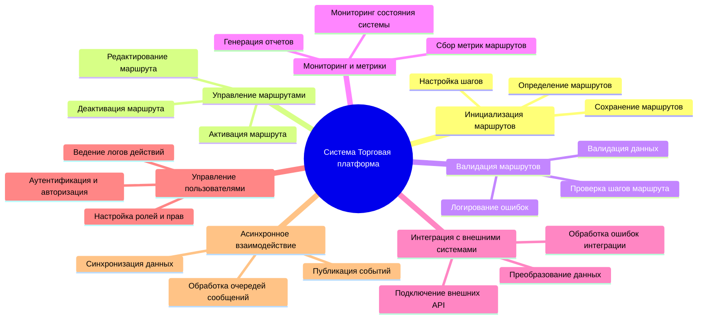
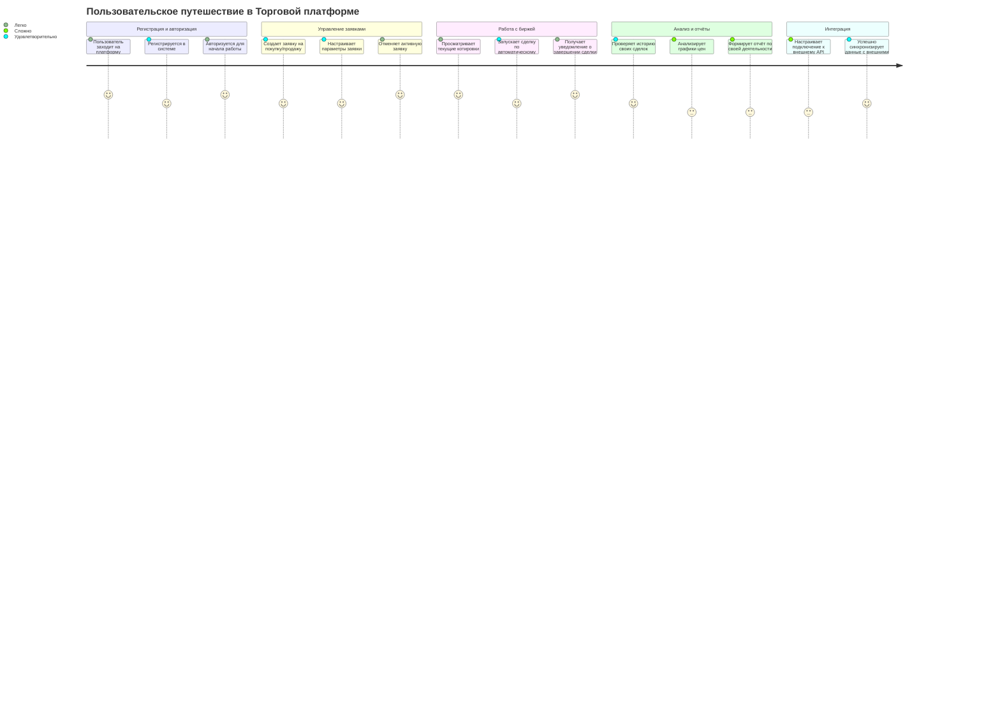
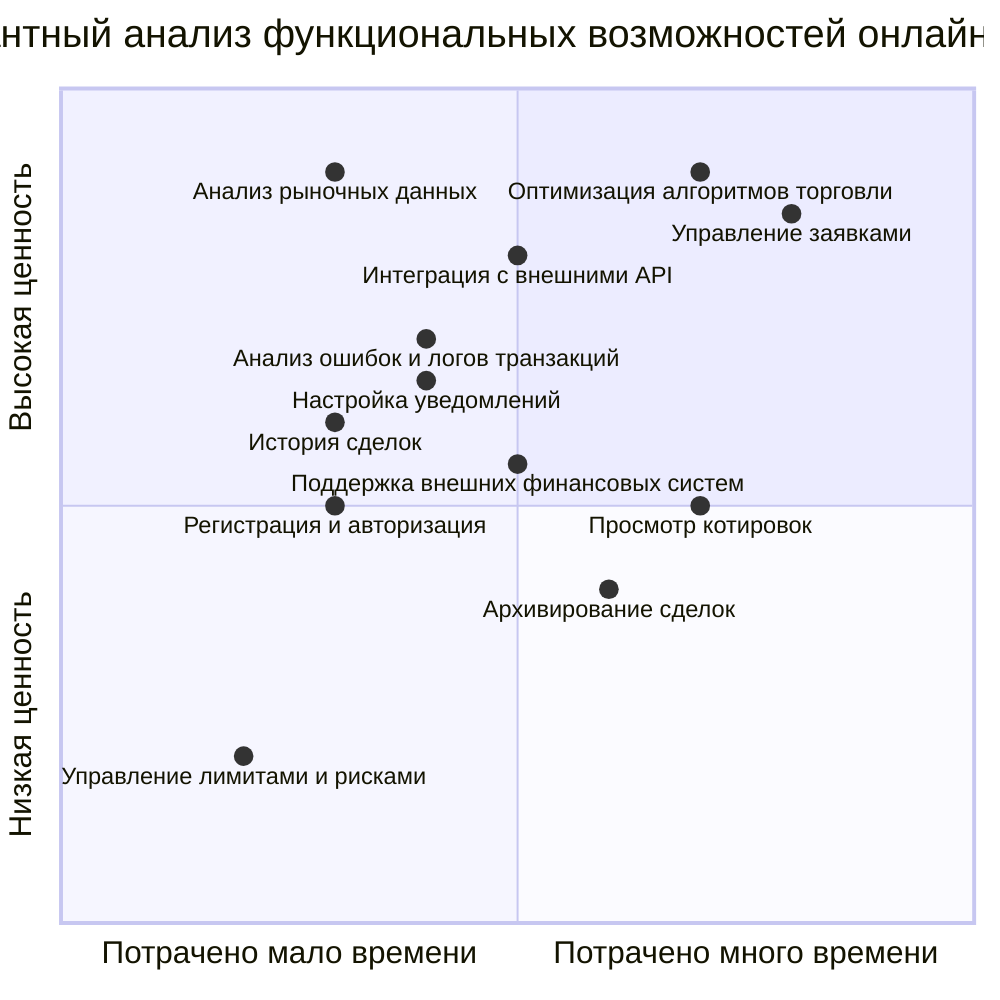
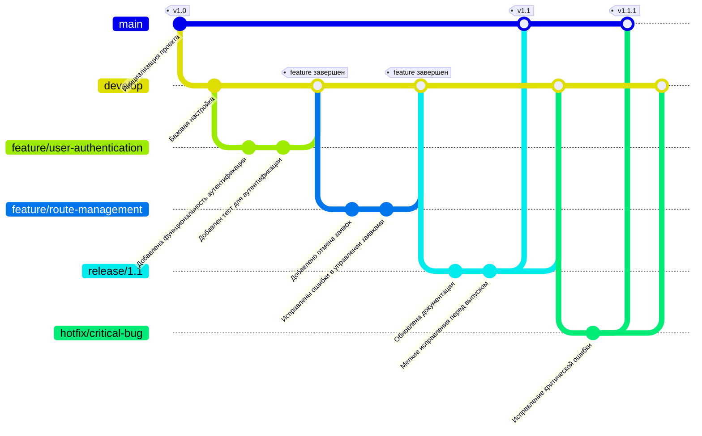

```mermaid
mindmap
  root((Система Торговая платформа))
    Инициализация маршрутов
      Определение маршрутов
      Настройка шагов
      Сохранение маршрутов
    Управление маршрутами
      Активация маршрута
      Деактивация маршрута
      Редактирование маршрута
    Валидация маршрутов
      Проверка шагов маршрута
      Валидация данных
      Логирование ошибок
    Мониторинг и метрики
      Сбор метрик маршрутов
      Мониторинг состояния системы
      Генерация отчетов
    Интеграция с внешними системами
      Подключение внешних API
      Преобразование данных
      Обработка ошибок интеграции
    Управление пользователями
      Аутентификация и авторизация
      Настройка ролей и прав
      Ведение логов действий
    Асинхронное взаимодействие
      Публикация событий
      Обработка очередей сообщений
      Синхронизация данных
```

```mermaid
journey
    title Пользовательское путешествие в Торговой платформе
    section Регистрация и авторизация
      Пользователь заходит на платформу: 5: Легко
      Регистрируется в системе: 4: Удовлетворительно
      Авторизуется для начала работы: 5: Легко
    section Управление заявками
      Создает заявку на покупку/продажу: 4: Удовлетворительно
      Настраивает параметры заявки: 4: Удовлетворительно
      Отменяет активную заявку: 5: Легко
    section Работа с биржей
      Просматривает текущие котировки: 5: Легко
      Запускает сделку по автоматическому исполнению: 4: Удовлетворительно
      Получает уведомление о завершении сделки: 5: Легко
    section Анализ и отчёты
      Проверяет историю своих сделок: 4: Удовлетворительно
      Анализирует графики цен: 3: Сложно
      Формирует отчёт по своей деятельности: 3: Сложно
    section Интеграция
      Настраивает подключение к внешнему API: 3: Сложно
      Успешно синхронизирует данные с внешними системами: 4: Удовлетворительно
```

```mermaid
quadrantChart
    title Квадрантный анализ функциональных возможностей онлайн биржи
    x-axis "Потрачено мало времени" --> "Потрачено много времени"
    y-axis "Низкая ценность" --> "Высокая ценность"
    "Управление заявками": [0.8, 0.85] 
    "Анализ рыночных данных": [0.3, 0.9]
    "Регистрация и авторизация": [0.3, 0.5]
    "Просмотр котировок": [0.7, 0.5]
    "Интеграция с внешними API": [0.5, 0.8]
    "Управление лимитами и рисками": [0.2, 0.2]
    "Настройка уведомлений": [0.4, 0.65]
    "История сделок": [0.3, 0.6]
    "Архивирование сделок": [0.6, 0.4]
    "Анализ ошибок и логов транзакций": [0.4, 0.7]
    "Оптимизация алгоритмов торговли": [0.7, 0.9]
    "Поддержка внешних финансовых систем": [0.5, 0.55]
```

```mermaid
gitGraph
   commit id: "Инициализация проекта" tag: "v1.0"
   branch develop
   checkout develop
   commit id: "Базовая настройка"
   branch feature/user-authentication
   checkout feature/user-authentication
   commit id: "Добавлена функциональность аутентификации"
   commit id: "Добавлен тест для аутентификации"
   checkout develop
   merge feature/user-authentication tag: "feature завершен"
   branch feature/route-management
   checkout feature/route-management
   commit id: "Добавлено отмена заявок"
   commit id: "Исправлены ошибки в управлении заявками"
   checkout develop
   merge feature/route-management tag: "feature завершен"
   branch release/1.1
   checkout release/1.1
   commit id: "Обновлена документация"
   commit id: "Мелкие исправления перед выпуском"
   checkout main
   merge release/1.1 tag: "v1.1"
   checkout develop
   merge release/1.1
   branch hotfix/critical-bug
   checkout hotfix/critical-bug
   commit id: "Исправление критической ошибки"
   checkout main
   merge hotfix/critical-bug tag: "v1.1.1"
   checkout develop
   merge hotfix/critical-bug
```